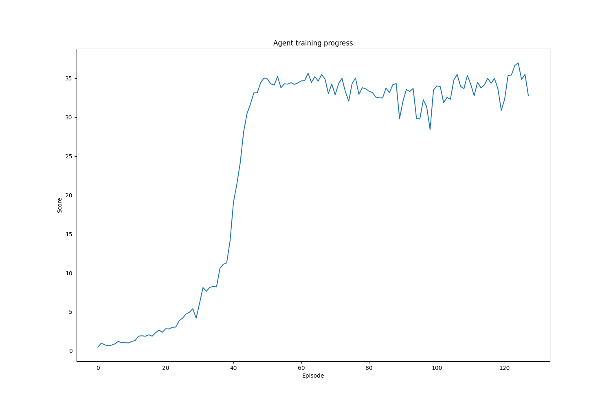
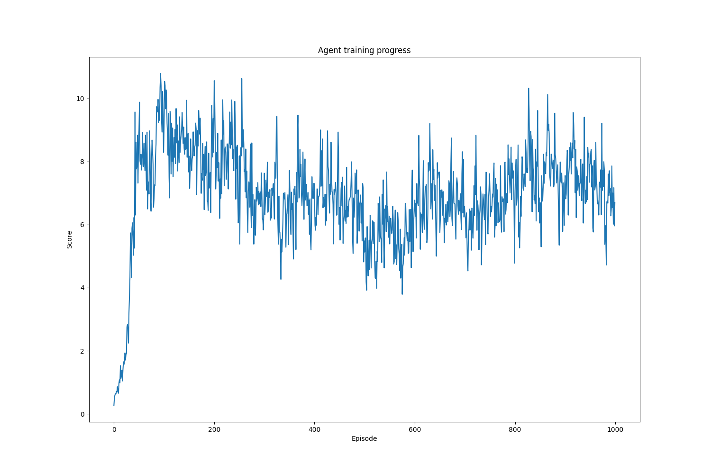
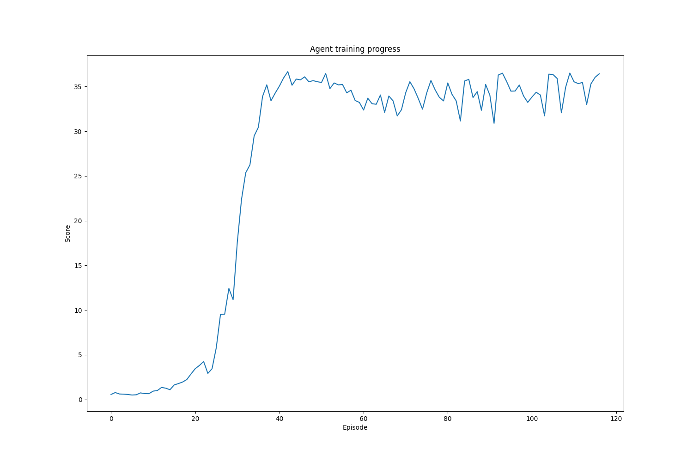

# Deep Reinforcement Learning - P2 Reacher Continuous Control

## Overview

Deep Deterministic Policy Gradient ([DDPG](https://arxiv.org/pdf/1509.02971.pdf)) reinforcement learning agents were programmed to solve a unity based double jointed robotic arm environment (defined as an average score exceeding +30 over 100 episodes).

## Architectures

The base architecture employed was a DDPG agent with an experience replay and soft updating weights between the local and target networks for both the actor and critic. Since the actor has deterministic actions, Ornstein-Uhlenbeck noise was added to the actions to allow the agent to explore. This type of noise was chosen because it is auto-correlated, which has been identified as effective in tasks with momentum. Batch normalisation was not implemented. The base architecture is described as follows:

#### DDPG

The input and output sizes of the actor and critic are determined by the environment. The number of hidden layers and the size of layers are controlled by the parameters

```
actor_fc_layers=128,64
crtitc_fc_layers=128,64
```

as set in the config. In this implementation, the actions of the actor are fed into the second hidden layer of the critic.

* Actor
  * Linear: (33, 128) - Leaky ReLU
  * Linear: (128, 64) - Leaky ReLU
  * Linear: (64, 4) - tanh

* Critic
  * Linear: (33, 128) - Leaky ReLU
  * Linear (with concatenation): (128 + action_size, 64) - Leaky ReLU
  * Linear: (64, 1) - Linear

Since the based architecture worked very well, no improvements were sought. Instead, two additional architectures with intentional regressions from the benchmark implementation were introduced to explore performance degradation.

#### DDPG without noise

This architecture was identical but the Ornstein-Uhlenbeck noise was not added to the actions.

#### DDPG without mid-network concatenation

The base implementation feeds the action vector into the second hidden layer of the critic's network. This effectively allows the first layer to extract a representation from the state without the action, then to pair the information later. To see if this helps the critic learn, this was removed and instead the state and action concatenated before the first layer.

The architecture of the critic therefore changes to

* Critic
  * Hidden: (33 + action_size, 128) - Leaky ReLU
  * Hidden: (128, 64) - Leaky ReLU
  * Output: (64, 1) - Linear

## Hyperparameters


The following parameters were set by using common values found online as shown below. Changing the network architecture was not explored beyond the difference in concatenation, however in this framework it would be easy to optimise like any other hyperparameter by just changing the config and not any code.

```
gamma=0.99
buffer_size=8192
batch_size=128
update_every=1
actor_tau=1e-3
actor_lr=1e-4
actor_fc_layers=128,64
critic_tau=1e-3
critic_lr=1e-4
critic_fc_layers=128,64
```

Additionally, the Ornstein-Uhlenbeck noise had hardcoded parameters of 

```
mu=0.
theta=0.15
sigma=0.2
```

## Results

The three agents were each trained once using the default parameters until they reached an average score of +30 across 100 episodes. The number of episodes until solved is here defined as the end of the window during training, which may overestimate the point where the agent would have been able to produce 100 consecutive episodes with a satisfactory score. The training progresses of each are shown below.


The base DDPG agent took 128 episodes to solve the environment.


The DDPG agent where no noise was added to the actions failed to solve the environment.


The DDPG agent where states and actions were concatenated before being fed to the critic took 118 episodes to solve the environment.


These results suggest that the noise is very important to agent training progress. Without noise to induce exploration, the policy was unable to improve past a low score. It would be very interesting to see how the parameters of the noise, such as changing the scale over time, affect the training process. Where the action information is fed into the critic appears much less important, however.

The model weights from the trained agents were placed in the path `agents/checkpoints`.

## Future Improvements

Solving this environment could be improved with the following

- Repeating the training process with different random seeds to more reliably compare different architectures
- Perform stability analysis of training using different random seeds
- Implement batch normalisation
- Perform hyper parameter optimisation
- Investigate the effect of the scale of the noise and if a time-varying scale could be used to reduce exploration in a similar way to epsilon decay for DeepQ networks
- Implement other architectures such as A2C, PPO and D4PG